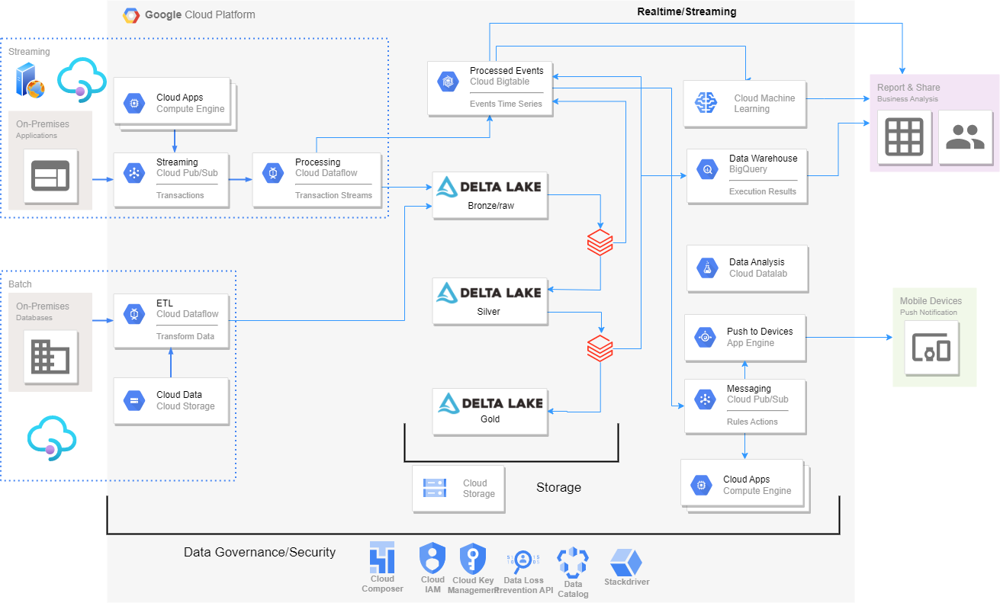

# Teste técnico Boticario - Data engineer




> Nesse projeto passaremos pela proposta de arquitetura em nuvem para streaming/batch processing dentro do Google Cloud Platform

### Ajustes e melhorias

Possíveis melhorias no código e no pipeline:

- [ ] Adicionar manipulação de arquivos mais eficiente nas dags de ingestão. Ex: Escanear a pasta de landing por todos arquivos presentes
- [ ] Adicionar manipulação de arquivos para ter histórico + backups case seja necessário reprocessamento. EX: Landing -> Archive -> Processed/Error
- [ ] Compartimentalizar melhor as funções em arquivos "de função" para serem carregados como pacotes/libs
- [ ] Finalizar DAG twitter assim que liberada a conta de desenvolvedor
- [ ] Possível inclusão de spark/dataproc em caso de maior volume de dados

## 💻 Pré-requisitos

Antes de começar, verifique se você atendeu aos seguintes requisitos:
<!---Estes são apenas requisitos de exemplo. Adicionar, duplicar ou remover conforme necessário--->
* Em seu ambiente de cloud compose instalou os seguintes pacotes PyPI `<openpyx, pandas-gbq, pandas, datetime>`
* Você tem uma máquina `<Windows / Linux / Mac>` com acesso ao GCP(Google Cloud Platform)

## 🚀 Instalando <Botitest>

Para instalar o <Botitest>, siga estas etapas:

GCP:
```
<Crie um bucket de dados para storage, seus datasets/procedures no google bigquery e uma instancia do cloud compose para orquestração>
```
## ☕ Usando <Botitest>

Para usar <Botitest>, siga estas etapas:

```
<Após criado o bucket e as instancias mencionadas acima, abra a interface WebUI de seu cloud composer e execute as dags do projeto>
```

[⬆ Voltar ao topo](#nome-do-projeto)<br>
